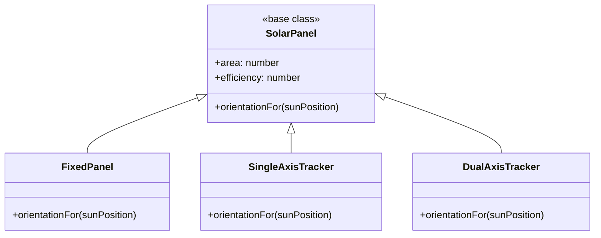

# SolarScope project guide

## Short project proposal

SolarScope is an interactive simulation that demonstrates how the position of the Sun, panel orientation, weather, shading, and tracking hardware affect solar-panel energy production. Users can compare fixed, single-axis, and dual-axis solar arrays through animation, graphs, and a simple return-on-investment estimate, allowing them to evaluate when a more expensive tracking system is commercially worthwhile.

## Project scope

SolarScope is intentionally a solo-project scope. It models one solar field and three panel strategies:

- Fixed tilt: low capital cost and no moving parts.
- Single-axis tracking: follows the Sun from east to west.
- Dual-axis tracking: follows both the Sun's east-west and altitude movement.

The user can change panel count, module efficiency, cloud cover, nearby shading, electricity price, and tracker hardware cost. The application responds with a live sky model, current power, daily energy, annual energy value, a through-the-day comparison chart, and a recommended investment path.

The simulation is an educational model rather than an engineering quotation. Its value is that every assumption is visible and every output can be traced back to a small number of understandable equations.

## Technical approach

SolarScope is a client-side React and TypeScript application. The simulation is deterministic: the same inputs always produce the same outputs, which makes the tool reliable during a presentation and easy to validate with hand calculations.

For each time step in the selected day:

1. Calculate an approximate solar altitude and azimuth.
2. Calculate the panel's incidence angle for the selected tracking strategy.
3. Convert the angle into an alignment factor using `max(0, cos(theta))`.
4. Apply daylight, cloud, and shading factors.
5. Calculate power for the selected panel count.
6. Add power over the time interval to estimate daily energy.
7. Convert daily energy into annual energy value and a simple payback period.

The central educational equation is:

```text
P = A × η × G × daylight × cos(θ) × cloudFactor × shadeFactor
```

Where:

- `A` is the total panel area.
- `η` is module efficiency.
- `G` is peak solar irradiance.
- `θ` is the angle between the Sun's rays and the panel normal.
- `cloudFactor` and `shadeFactor` reduce the available light.

The model uses a 15-minute step for daily energy and a continuous slider for the animated time readout. The Sun is above the horizon from 5:30 AM to 6:30 PM, reaches a simplified 64-degree altitude at noon, and is drawn as a moving point in the visual stage.

## Why the model is simplified

The application does not attempt to reproduce a particular site's complete atmospheric, electrical, or mechanical behavior. It omits temperature coefficients, inverter losses, latitude/longitude calculations, maintenance, battery storage, seasonal weather, and detailed row geometry. These are appropriate future enhancements, but including them in the first version would make the code harder to explain without improving the central demonstration.

## Three-week solo task plan

### Week 1: model and proof of concept

- Confirm requirements and write down assumptions.
- Sketch the user flow and screen layout.
- Implement solar position and incidence-angle functions.
- Implement the shared panel class and the three tracking strategies.
- Implement power and daily-energy calculations.
- Check the model with simple cases: night is zero, a perpendicular panel has maximum alignment, and a 90-degree incidence angle contributes approximately zero.
- Render the first moving Sun and panel field.

### Week 2: interactive simulator

- Add the scenario controls.
- Add panel-array rendering.
- Add play, pause, reset, and run-a-day controls.
- Add the power-through-the-day comparison chart.
- Add daily energy, annual value, and payback calculations.
- Add the investor recommendation.
- Explain the equation and assumptions inside the interface.

### Week 3: evidence and presentation

- Validate representative results by hand.
- Test extreme and invalid input cases.
- Improve responsive layout, labels, contrast, and animation.
- Capture screenshots for the report.
- Finish the class-hierarchy diagram and report figures.
- Rehearse a six-minute presentation with a fixed demo scenario.
- Prepare screenshots as a backup to the live demo.

## Class hierarchy and responsibilities

The only user-defined class hierarchy is between the panel strategies. The numerical simulation and financial calculations are pure functions in the same module; this is deliberate because it keeps the equations easy to trace. The UI is composed of React function components, which are not part of the scientific class hierarchy.



The rest of the implementation is organized as functions and data:

- `solarPosition`, `powerAt`, `simulateDay`, and `projectAt` form the simulation pipeline.
- `dailyEnergy`, `annualValue`, `capitalCost`, and `paybackYears` form the financial readout.
- `recommendation` evaluates all three strategies with the same scenario inputs.
- React components handle controls, animation, chart rendering, and display.

This is an intentional alternative to a deep hierarchy: the only behavior that varies by type is panel tracking, so only that behavior uses inheritance.

## Presentation plan: approximately six minutes

1. **0:00–0:45 — Problem:** solar investors must compare extra energy against tracking hardware cost.
2. **0:45–1:30 — Scientific idea:** useful energy depends on the angle between sunlight and the panel.
3. **1:30–2:30 — Technical approach:** explain the time steps, the core equation, and the three tracking strategies.
4. **2:30–4:30 — Demonstration:** run the default day, change the tracking mode, then increase cloud cover or shading.
5. **4:30–5:15 — Results:** show daily energy, annual value, chart separation, and payback.
6. **5:15–6:00 — Commercial version:** discuss real weather, location data, maintenance, battery storage, and uncertainty.

The safest demonstration sequence is:

1. Start at solar noon with the default single-axis scenario.
2. Press **run a day** so the Sun and the field animate.
3. Select **Fixed tilt** and point out the lower curve.
4. Select **Dual-axis** and point out the improved alignment.
5. Increase cloud cover and explain why all strategies fall together.
6. Return to single-axis and finish on the investor readout.

## Report outline

### 1. Problem statement and background

Describe the energy-versus-cost decision and why panel orientation matters. Define the target user as a non-expert investor or project planner.

### 2. Technical approach and simulation method

Explain the Sun approximation, incidence angle, power equation, time stepping, weather/shading factors, and financial model. State the assumptions and limitations explicitly.

### 3. Software design

Include the class-hierarchy diagram, the data flow from controls to simulation to chart, and short explanations of the simulation, financial, and rendering responsibilities.

### 4. Results and screenshots

Include the default scenario, a fixed-versus-tracking comparison, a weather/shading sensitivity example, and screenshots of the stage, controls, chart, and investor readout. Explain what each result means rather than only listing numbers.

### 5. Future commercial version

Discuss location-specific Sun paths, real weather feeds, temperature and inverter losses, detailed shading geometry, maintenance costs, battery storage, grid tariffs, uncertainty ranges, and exporting a feasibility report.

## Commercial-version enhancements

- Accept latitude, longitude, date, and roof orientation.
- Use historical weather and satellite irradiance data.
- Model temperature, inverter efficiency, wiring loss, and panel degradation.
- Add row spacing and time-dependent shadows.
- Include maintenance and replacement costs in the payback model.
- Add battery storage and time-of-use electricity pricing.
- Show optimistic, typical, and conservative scenarios rather than one deterministic answer.
- Export a short investor report containing assumptions, charts, and a recommendation.